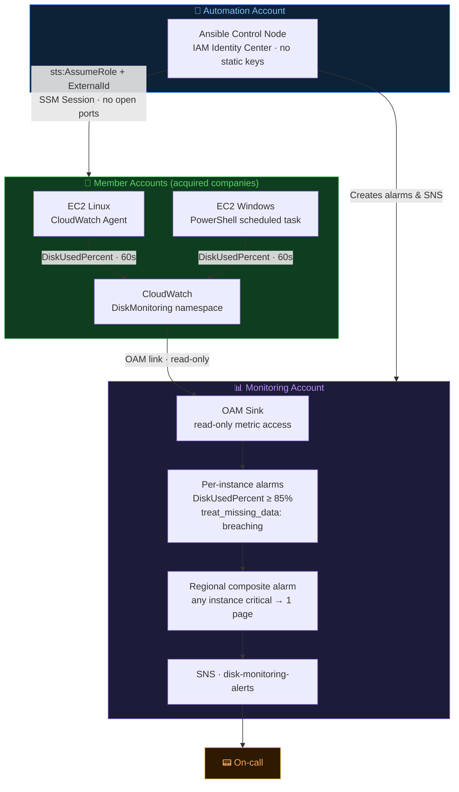

# Disk Utilization Monitoring Across AWS Accounts

**Assessment:** Solutions Architect — Cloud Consultant case study  
**Cloud provider:** AWS

---

## Architecture overview



---

## Problem

A multi-account AWS environment grown through acquisitions needs early warning on disk space exhaustion across all EC2 instances (Linux and Windows). Ansible is already in the environment. The solution must avoid adding a third-party monitoring platform without clear justification.

---

## Access management

Zero static credentials. Credential chain:

```
IAM Identity Center / OIDC CI role (Automation account)
  └─ sts:AssumeRole → DiskMonitoringAutomationRole (each member account)
       Condition: ExternalId = disk-monitoring-<account-id>
       └─ SSM Session Manager → EC2 instance
            outbound HTTPS only · zero inbound ports · CloudTrail logged
```

**Automation role permissions:** `ec2:Describe*`, `ssm:StartSession`, `ssm:DescribeInstanceInformation`, S3 read/write on the SSM transfer bucket only. Cannot create or delete AWS resources.

**Instance profile:** `AmazonSSMManagedInstanceCore` + `CloudWatchAgentServerPolicy`. Nothing else.

**Monitoring account:** accesses member metrics via OAM (read-only). No trust relationship into member accounts — cannot assume roles or modify resources there.

All IAM roles, trust policies, and OAM links are provisioned by Terraform (`terraform/account-bootstrap/` per member account, `terraform/org-oam-sink/` once in the monitoring account).

---

## VM discovery and enrollment

Dynamic inventory via `amazon.aws.aws_ec2` — one file per account in `inventory/accounts/`. Discovers all running instances at playbook run time using the assumed cross-account role. No static host lists.

```yaml
plugin: amazon.aws.aws_ec2
assume_role_arn: arn:aws:iam::111111111111:role/DiskMonitoringAutomationRole
filters:
  instance-state-name: running
compose:
  ansible_aws_ssm_region: placement.region   # actual region, not hardcoded
  ansible_connection: "'amazon.aws.aws_ssm'"
  account_id: "'111111111111'"
```

**Enrollment:** Instance boots with `DiskMonitoringInstanceProfile` → next Ansible run discovers it → `ssm_bootstrap` verifies SSM reachability → `cloudwatch_agent` installs and configures the agent → `disk_alerting` creates the alarm. Every role is idempotent; nightly runs correct drift.

**New account:** `terraform apply account-bootstrap/` → add one inventory file → run playbook.

---

## Disk collection

**Linux:** CloudWatch Agent renames `disk_used_percent` → `DiskUsedPercent` in the `DiskMonitoring` namespace. Config: `roles/cloudwatch_agent/templates/amazon-cloudwatch-agent.json.j2`.

**Windows:** The CW Agent natively emits `% Free Space` (inverted). A PowerShell scheduled task (`roles/cloudwatch_agent/files/emit-disk-metrics.ps1`) runs every minute as SYSTEM, calculates `(Size − FreeSpace) / Size × 100`, and calls `aws cloudwatch put-metric-data` to emit `DiskUsedPercent` — identical metric name to Linux.

Both platforms emit: `DiskUsedPercent`, `DiskFreeBytes`, `DiskUsedBytes`, `DiskCapacityBytes` with dimensions `InstanceId`, `AccountId`, `AccountName`, `Platform`.

> Ansible is used for installation and drift correction only — **not** for continuous 60-second polling. The agent push model scales independently of Ansible.

---

## Central aggregation and alerting

**OAM** links each member account to the monitoring account's sink. The monitoring account can query cross-account metrics natively — no data copying, no custom pipeline.

**Per-instance alarm** (monitoring account, cross-account metric query):
```yaml
metrics:
  - id: disk_used
    account_id: "{{ hostvars[item]['account_id'] }}"  # MetricDataQuery level — not a dimension
    metric_stat:
      metric:
        namespace: DiskMonitoring
        metric_name: DiskUsedPercent
        dimensions:
          - name: InstanceId
            value: "{{ item }}"
      period: 60
      stat: Average
threshold: 85.0
treat_missing_data: breaching   # dead agent = alarm, not silence
```

`account_id` is set at the `MetricDataQuery` level — this is the correct CloudWatch cross-account alarm mechanism. Setting it as a metric dimension does not work for alarm routing.

**Composite alarm:** one per region — `ALARM("disk-critical-<account>-<instance>") OR ...` — fires once regardless of how many instances are critical simultaneously.

**Alarm placement:** both per-instance and composite alarms live in the monitoring account. CloudWatch composite alarms can only reference alarms in the same account and region — member-account alarms cannot be aggregated cross-account.

---

## Scalability

| Dimension | How it scales |
|---|---|
| New VMs | Dynamic inventory discovers on next run; nightly drift sweep enrolls automatically |
| New accounts | One `terraform apply` + one inventory file |
| New regions | OAM link + alarms per region; inventory file lists regions |
| Large fleets (~200+ instances/region) | Hierarchical composite alarms: per-account composites → regional composite |
| Alert noise | Composite alarm sends one notification regardless of how many instances breach |

---

## Key design decisions

| Decision | Rationale |
|---|---|
| AWS | Production familiarity; SSM and OAM are exactly the native services needed |
| SSM over SSH | No key distribution across acquired accounts; IAM-based; full audit trail; zero open ports |
| CloudWatch Agent push over Ansible polling | Ansible polling every 60s across thousands of instances is impractical; agent scales independently |
| OAM over custom aggregation | Native, read-only, no infrastructure to operate; no ETL pipeline to maintain |
| Alarms in monitoring account | CloudWatch requirement — composite alarms must reference same-account alarms |

---

## Known limitations

| Item | Notes |
|---|---|
| Windows IMDSv2 | PowerShell script uses IMDSv1; will fail if account enforces IMDSv2 token requirement |
| Alarm cleanup | No automated cleanup when instances are terminated; stale alarms accumulate |
| Composite alarm scale | Rule string limit (~170 instances/region); hierarchical composites needed at scale |
| Windows IMDSv2 (not live-tested) | PowerShell script uses IMDSv1; tested on Linux only — see `docs/TEST-RESULTS.md` for live validation scope |

---

## Repo layout

```
ansible.cfg / requirements.yml      Ansible configuration and collection dependencies
group_vars/all.yml                  Global variables: thresholds (85%/75%), namespace, SNS name

inventory/accounts/                 One file per AWS account — dynamic EC2 discovery
playbooks/site.yml                  Three plays: ssm_bootstrap → cloudwatch_agent → disk_alerting

roles/
  ssm_bootstrap/                    Pre-flight SSM reachability check via STS AssumeRole
  cloudwatch_agent/                 CW Agent (Linux) or PowerShell scheduled task (Windows)
  disk_alerting/                    Per-instance + composite alarms in monitoring account

terraform/
  account-bootstrap/                IAM roles, instance profile, S3 SSM bucket, OAM link
  org-oam-sink/                     OAM sink + SNS topic in monitoring account

tests/
  test_alarm_rule_generation.py     15 offline tests
  demo_offline.py                   End-to-end offline demo

docs/
  architecture.md                   Account topology, data flow, onboarding diagrams
  TEST-RESULTS.md                   Validation results and known gaps
```

---

## Running locally

```bash
# Validate Terraform (no AWS credentials needed)
cd terraform/account-bootstrap && terraform validate
cd ../org-oam-sink && terraform validate

# Run tests (no AWS credentials needed)
python3 -m venv .venv && source .venv/bin/activate && pip install pytest jinja2
python3 -m pytest tests/test_alarm_rule_generation.py -v

# Offline demo
python3 tests/demo_offline.py
```

---

## PoC vs production

This solution has been validated end-to-end against a live AWS environment across three regions (us-east-1, us-east-2, eu-west-1) on the `live-aws-validation` branch — see `docs/TEST-RESULTS.md` for full evidence including playbook output and confirmed CloudWatch alarm states. The `main` branch retains the canonical assessment submission with placeholder account IDs. Production deployment would additionally require: automated account onboarding via Organizations + EventBridge, SSM session logging, alarm cleanup on instance termination, Windows IMDSv2 token handling, and per-workload threshold policies.
