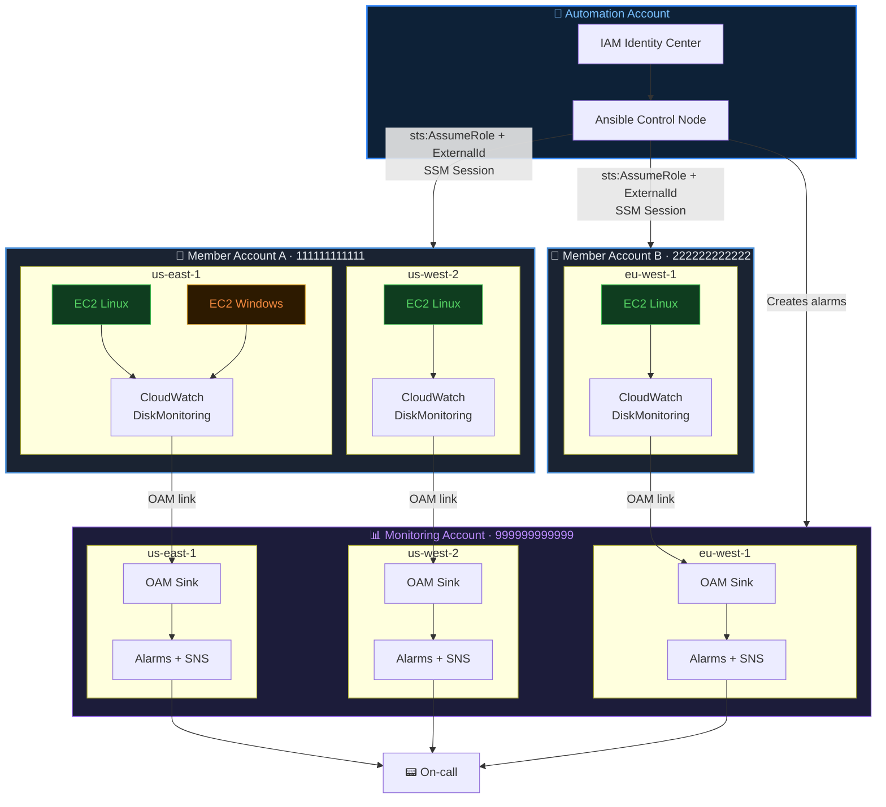
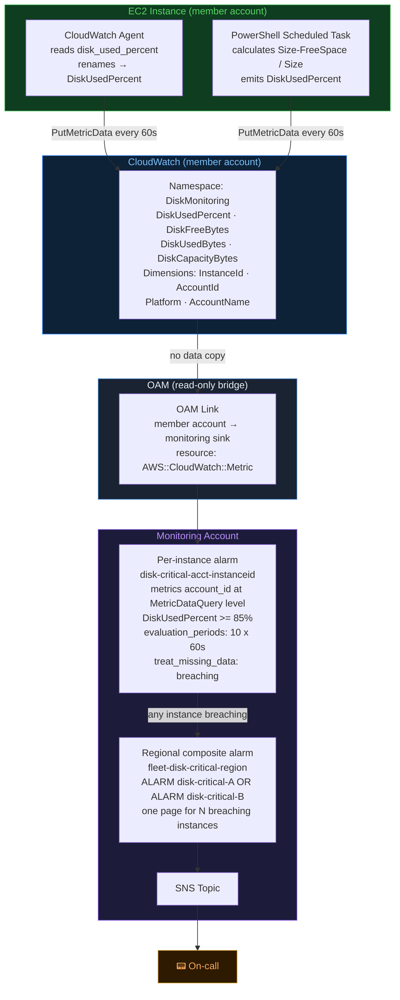
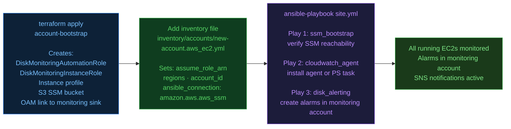

# Architecture

## 1. Account topology

---

## 2. End-to-end disk monitoring flow

**Why `account_id` is at the `MetricDataQuery` level, not a metric dimension:**  
CloudWatch cross-account alarms route the metric lookup via `metrics[].account_id` in the alarm definition. Setting `AccountId` as a metric dimension has no effect on alarm routing — the alarm would look for the metric in the monitoring account's own namespace and never find it.

**Why alarms live in the monitoring account:**  
CloudWatch composite alarms can only reference alarms in the same account and region. Per-instance alarms must therefore also live in the monitoring account, not in member accounts.

---

## 3. New account onboarding

---

## IAM trust boundaries

| Identity | Can do | Cannot do |
|---|---|---|
| Automation account | AssumeRole into member accounts, start SSM sessions, read/write SSM S3 bucket | Create/delete resources, access data, call any other service |
| Member account instance | Push metrics to CloudWatch, register with SSM | Access other accounts, modify IAM, read secrets |
| Monitoring account | Read cross-account metrics via OAM, manage alarms and SNS | AssumeRole into member accounts, modify member-account resources |

`DiskMonitoringAutomationRole` trust policy requires `ExternalId: disk-monitoring-<account-id>` — prevents confused-deputy attacks where a shared automation account is tricked into assuming roles it was not intended to manage.
