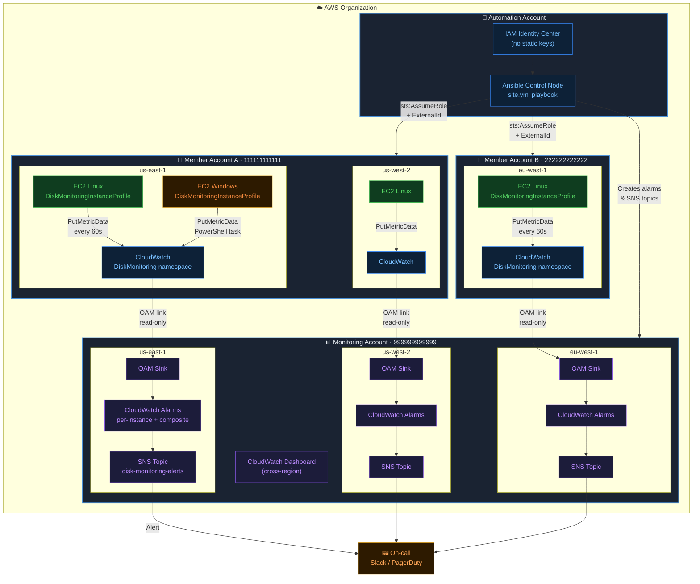
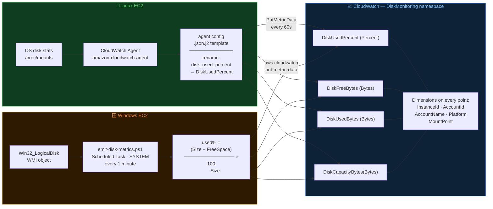
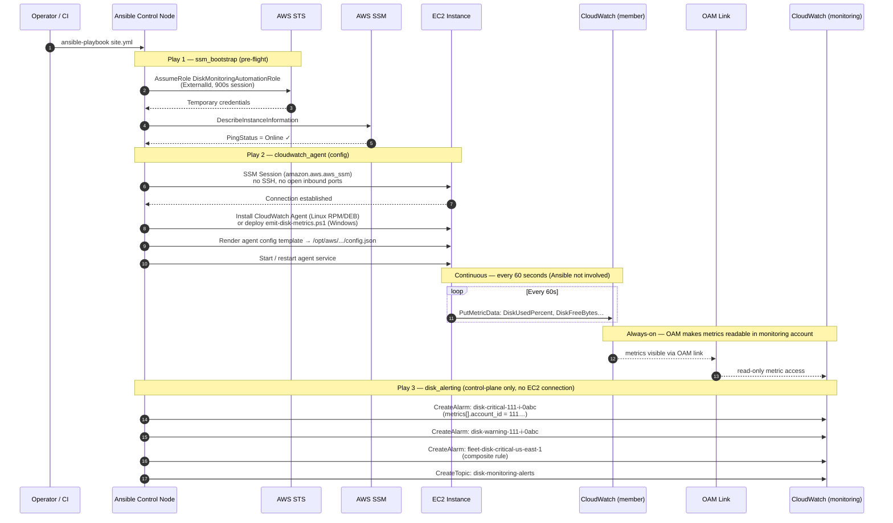
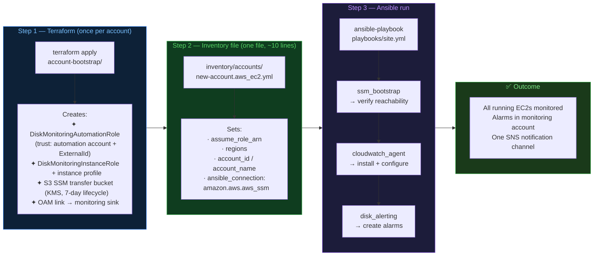
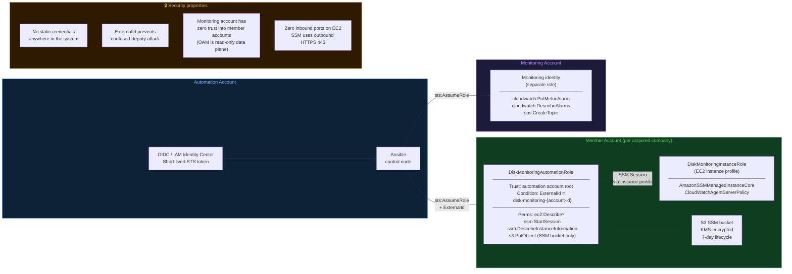

# Architecture

## 1. Account topology



---

## 2. Metric collection — Linux vs Windows



---

## 3. Cross-account alarm chain

```mermaid
flowchart TD
    subgraph SRC["Member Account (source)"]
        AGENT["CloudWatch Agent /\nPowerShell task"]
        CWM["CloudWatch Metrics\nDiskMonitoring::DiskUsedPercent\n─────────────────────────\nPeriod: 60s  ·  Stat: Average"]
        AGENT -->|PutMetricData| CWM
    end

    subgraph LINK["OAM  (read-only bridge)"]
        OAMLINK["OAM Link\naccount 111… → monitoring sink\n─────────────────────────\nResource type:\nAWS::CloudWatch::Metric"]
    end

    CWM -->|"read-only\n(no data copy)"| OAMLINK

    subgraph MON["Monitoring Account"]
        subgraph INST["Per-instance alarm  ×N"]
            PA["alarm: disk-critical-111…-i-0abc\n─────────────────────────────\nmetrics[].account_id: 111…\nDiskUsedPercent ≥ 85%\nevaluation_periods: 10  ×  60s\ntreat_missing_data: breaching"]
        end
        subgraph COMP["Regional composite alarm  ×1 per region"]
            CA["alarm: fleet-disk-critical-us-east-1\n─────────────────────────────────\nrule: ALARM(\"disk-critical-111-i-0abc\")\n   OR ALARM(\"disk-critical-111-i-0def\")\n   OR ALARM(\"disk-critical-222-i-0xyz\")"]
        end
        SNS_T["SNS Topic\ndisk-monitoring-alerts"]
        PA -->|"any instance\nin ALARM state"| CA
        CA -->|"1 notification\nfor N instances"| SNS_T
    end

    OAMLINK --> PA

    ALERT["📟 On-call\nSlack / PagerDuty / Email"]
    SNS_T --> ALERT

    note1["⚠️  account_id is set at\nthe MetricDataQuery level\n(metrics[].account_id)\nnot as a metric dimension"]

    style SRC   fill:#0f3d1f,stroke:#3fb950,color:#56d364
    style LINK  fill:#1a2332,stroke:#4a90d9,color:#e8edf2
    style MON   fill:#1c1c3a,stroke:#8957e5,color:#bc8cff
    style ALERT fill:#2d1a00,stroke:#d29922,color:#ffa657
    style note1 fill:#2d2208,stroke:#d29922,color:#e3b341,font-size:11px
```

---

## 4. Ansible role sequence



---

## 5. New account onboarding



---

## 6. IAM trust model



---

## Why alarms live in the monitoring account

CloudWatch composite alarms can only reference alarms in the **same account and region**. Placing per-instance alarms in member accounts and the composite alarm in the monitoring account is therefore invalid — the composite could not reference them cross-account.

The correct model: per-instance alarms **and** composite alarms both live in the monitoring account, watching metrics that OAM has made readable there. Member accounts only run the CloudWatch Agent; they hold no alarms managed by this system.

## Multi-region design

OAM is regional. Each (source-account × source-region) pair needs its own OAM link. The `account-bootstrap` Terraform module creates one OAM link per region. The `disk_alerting` role creates alarms in the monitoring account in the region matching each instance's `ansible_aws_ssm_region`.

**Constraint:** An alarm in `eu-west-1` cannot reference a metric in `us-east-1`. Each region is independently alarmed. A single CloudWatch dashboard can aggregate the cross-region view for operators.

## Ansible's role in this architecture

Ansible is an **onboarding and drift-correction tool**, not a telemetry collection engine.

| Ansible does | Ansible does NOT do |
|---|---|
| Install CloudWatch Agent (or PS task) | Poll disk usage every minute |
| Create CloudWatch alarms | Collect or forward metrics |
| Verify SSM reachability pre-flight | Run continuously on instances |
| Correct configuration drift (nightly) | Replace the agent push model |

This distinction matters at scale: Ansible polling 5,000 instances every minute would be impractical. The agent-push model scales to tens of thousands of instances with zero Ansible involvement after initial setup.
